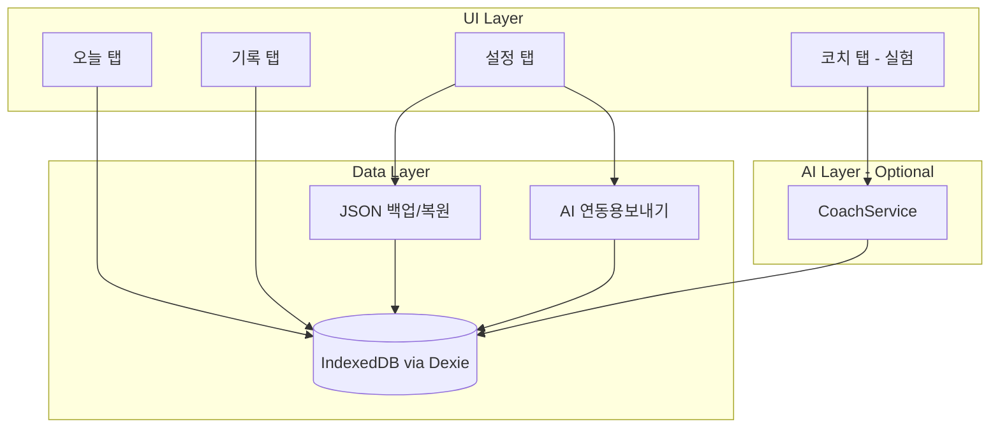
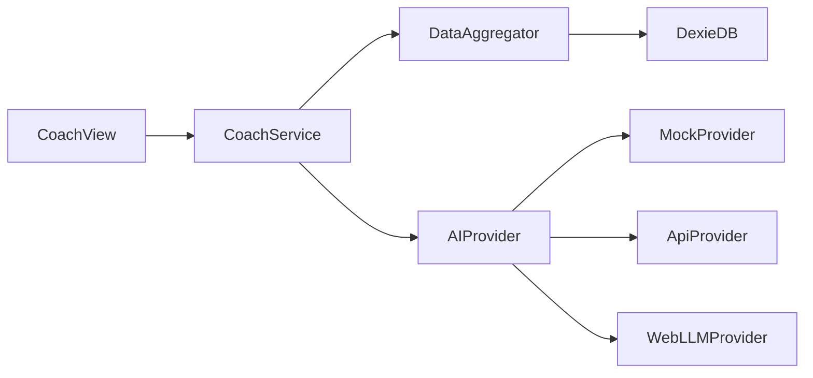
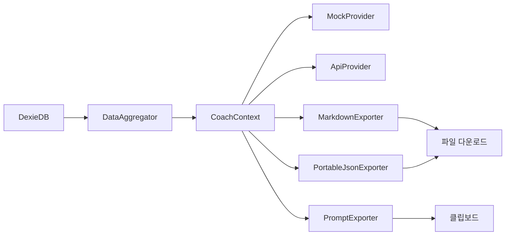

# 초토화 — 개인 헬스·식단 기록 웹 앱 구현 계획

## 기술 스택

| 영역 | 선택 | 이유 |
|------|------|------|
| 프레임워크 | Vite + Vue 3 + TypeScript | 사용자 규칙, 빠른 개발 |
| 스타일 | Tailwind CSS (`gray-50` 대신 `gray-100`) | 모바일 퍼스트 UI |
| 로컬 DB | [Dexie.js](https://dexie.org/) (IndexedDB 래퍼) | 구조화 데이터, 쿼리, 대용량 |
| PWA | `vite-plugin-pwa` | 오프라인 + 홈 화면 추가 |
| 라우팅 | Vue Router | 탭 기반 화면 전환 |
| 상태 | Pinia (최소) | 오늘 날짜 로그 캐시, UI 상태 |
| 날짜 | `date-fns` | 일별 키(`YYYY-MM-DD`) 처리 |

---

## 앱 구조 (모바일 퍼스트)



**하단 네비게이션 4탭**
- **오늘** — 당일 운동·유산소·식단 입력 + 일일 영양 합계
- **기록** — 날짜별 과거 로그 조회/수정
- **코치** — AI 피드백 (실험, 배지 표시)
- **설정** — 백업보내기/가져오기, AI 연동용보내기, 목표(린메스업 등), AI 연결 설정

---

## 데이터 모델

[`src/types/log.ts`](src/types/log.ts) 에 정의:

```typescript
// 일별 로그 — date를 PK로 사용
interface DayLog {
  date: string              // "2026-06-19"
  workouts: WorkoutEntry[]
  cardio: CardioEntry[]
  meals: MealEntry[]
  updatedAt: string
}

interface WorkoutEntry {
  id: string
  exerciseId: string      // 프리셋 ID 또는 custom ID
  exerciseName: string
  sets: { weightKg: number; reps: number }[]
  note?: string
}

interface CardioEntry {
  id: string
  type: CardioType          // "running" | "cycling" | "walking" | ...
  durationMin: number
  distanceKm?: number
  calories?: number
}

interface MealEntry {
  id: string
  name: string
  calories: number
  carbsG: number
  proteinG: number
  fatG: number
  mealType: "breakfast" | "lunch" | "dinner" | "snack"
}
```

**Dexie 스키마** ([`src/db/index.ts`](src/db/index.ts)):
- `dayLogs`: `date` (PK), `updatedAt`
- `customExercises`: 사용자가 추가한 운동 프리셋
- `settings`: 목표 칼로리/매크로, AI 설정, 코치 목표(`lean_bulk` | `cut` | `maintain`)

**기본 운동 프리셋** ([`src/data/exercisePresets.ts`](src/data/exercisePresets.ts)):
- 벤치프레스, 스쿼트, 데드리프트, 숄더프레스, 랫풀다운, 바벨로우, 레그프레스, 컬, 트라이셉스 등 15~20개
- 카테고리: 가슴/등/하체/어깨/팔/코어
- 프리셋 선택 + "직접 추가"로 `customExercises`에 저장 (사용자 선택: 프리셋 + 자유 입력)

---

## 핵심 화면 설계

### 1. 오늘 탭 ([`src/views/TodayView.vue`](src/views/TodayView.vue))

3개 접이식 섹션:

**운동**
- "+ 운동 추가" → 프리셋 피커 (카테고리 필터) + 직접 추가
- 세트 입력: 무게(kg) × 반복, 세트 추가/삭제
- 이전 기록 참고: 같은 운동의 최근 세트를 회색 힌트로 표시 (로컬 DB 조회)

**유산소**
- 종류 선택 (달리기/자전거/걷기/기타)
- 시간(분), 선택적 거리·칼로리

**식단**
- 끼니별(아침/점심/저녁/간식) 구분
- 음식명 + 칼로리 + 탄수/단백/지방(g)
- 하단 **일일 합계 바**: 칼로리 / 탄수 / 단백 / 지방 (가로 막대 또는 숫자)

### 2. 기록 탭 ([`src/views/HistoryView.vue`](src/views/HistoryView.vue))

- 월간 캘린더 또는 날짜 리스트 (기록 있는 날 점 표시)
- 날짜 탭 → 해당일 로그 읽기 전용 + 수정 버튼
- 주간 요약: 총 운동 횟수, 평균 칼로리/단백질 (간단 집계)

### 3. 설정 탭 ([`src/views/SettingsView.vue`](src/views/SettingsView.vue))

**백업/복원 (핵심)**
- 보내기: 전체 DB → `chotohwa-backup-2026-06-19.json` 다운로드
- 가져오기: JSON 파일 선택 → **병합** 또는 **전체 덮어쓰기** 선택 후 확인
- 스키마 버전 필드 (`version: 1`) 포함 → 향후 마이그레이션 대비

**AI 연동용보내기 (핵심)**
- 앱 복원용 백업과 **별도** — ChatGPT, Claude, Gemini 등 외부 AI에 바로 넘길 수 있는 형태
- 기간 선택: 최근 7일 / 30일 / 전체
- 형식 3종 (설정 화면에서 선택):

| 형식 | 용도 | 파일명 예시 |
|------|------|-------------|
| **마크다운** | 채팅에 붙여넣기 | `chotohwa-report-2026-06-19.md` |
| **포터블 JSON** | Custom GPT, API, 자동화 | `chotohwa-context-2026-06-19.json` |
| **프롬프트** | "이 데이터 보고 피드백 줘" 한 방 복사 | 클립보드 복사 (파일 없음) |

- **클립보드 복사** 버튼 — 모바일에서 다른 앱으로 바로 전달
- 코치 탭 `DataAggregator`와 **동일 집계 로직 재사용** — 내부 AI / 외부 AI가 같은 컨텍스트 구조

**목표 설정**
- 코치용 컨텍스트: 린메스업 / 컷팅 / 유지 (나중에 AI 프롬프트에 주입)
- 일일 목표 칼로리·단백질 (선택, UI 합계와 비교)

### 4. 코치 탭 — 실험 ([`src/views/CoachView.vue`](src/views/CoachView.vue))

UI는 심플하게, "실험 기능" 배지:

```
[최근 7일 데이터 분석하기] 버튼
→ 로딩 → 마크다운 형태 피드백 표시
```

초기 구현은 **MockProvider** (하드코딩 규칙 기반 피드백)로 동작 확인 후, 설정에서 Provider 교체.

---

## AI 코치 아키텍처 (서브 기능, 낮은 결합도)



[`src/services/coach/`](src/services/coach/) 디렉터리:

```typescript
// src/services/coach/types.ts
interface CoachContext {
  goal: "lean_bulk" | "cut" | "maintain"
  recentDays: DayLog[]        // 최근 7~14일
  weeklySummary: WeeklyStats  // 집계된 수치
}

interface AIProvider {
  analyze(ctx: CoachContext): Promise<string>
}

// 구현체 (우선순위 순)
// 1. MockProvider  — 규칙 기반 ("단백질 평균 XXg, 목표 대비 부족")
// 2. ApiProvider   — OpenAI/Claude API (설정에 API key, 로컬 저장)
// 3. WebLLMProvider — @mlc-ai/web-llm (브라우저 로컬, 무거움, 나중에)
```

**DataAggregator** ([`src/services/coach/aggregator.ts`](src/services/coach/aggregator.ts)):
- Dexie에서 최근 N일 로그 수집
- 주간 평균 칼로리/매크로, 운동 빈도, 부위별 볼륨 계산
- LLM에 넘길 **구조화된 요약 JSON** 생성 (전체 raw 데이터 X → 토큰 절약)

**프롬프트 템플릿** ([`src/services/coach/prompts.ts`](src/services/coach/prompts.ts)):
- 목표(린메스업 등) + 주간 통계 → "부족한 부분", "보완 제안" 요청
- API Provider만 사용 시 서버 없이 클라이언트에서 직접 호출 (개인용이므로 OK, 단 API key는 localStorage)

**로컬 LLM 옵션 (나중에)**:
- [WebLLM](https://webllm.mlc.ai/) — 브라우저 WebGPU, 모델 다운로드 필요 (~수 GB), 모바일 성능 제한
- [Ollama](https://ollama.com/) — 데스크톱 로컬 서버, 모바일 웹과는 별도 환경
- **권장**: 1단계 Mock → 2단계 클라우드 API → 3단계 WebLLM 실험

코치 탭은 Provider 미설정 시 MockProvider로 동작 → 항상 뭔가 보여줌.

---

## AI 연동용 데이터보내기 (포터블 Export)

앱 백업 JSON은 **복원 전용** (내부 ID, Dexie 스키마 포함). 외부 AI용은 **읽기 쉬운 요약 + 표준 필드**로 분리.



### 공통 컨텍스트 (`CoachContext`)

코치 탭과 외부보내기가 **같은 구조** 공유 → 한 곳에서 집계, 여러 곳에서 소비.

```typescript
// src/services/coach/types.ts — 코치 + 외부 AI 공용
interface CoachContext {
  meta: {
    app: "chotohwa"
    schemaVersion: 1
    exportedAt: string
    period: { from: string; to: string; days: number }
  }
  profile: {
    goal: "lean_bulk" | "cut" | "maintain"
    dailyTargets?: { calories?: number; proteinG?: number }
  }
  summary: WeeklyStats          // 기간 평균 칼로리/매크로, 운동일 수, 유산소 시간
  dailyLogs: DayLogSummary[]    // 일별 요약 (raw 전체 X, 토큰 절약)
}
```

`DayLogSummary`는 일별로 운동 목록·세트·식단·매크로 합계를 **사람이 읽을 수 있는 평문 구조**로 압축.

### 형식별 스펙

**1. 마크다운 (`.md`)** — 채팅 붙여넣기용

```markdown
# 초토화 헬스 리포트 (2026-06-12 ~ 2026-06-19)

## 프로필
- 목표: 린메스업
- 일일 목표: 칼로리 2800kcal, 단백질 160g

## 주간 요약
- 운동일: 5/7일 | 평균 칼로리: 2650kcal | 평균 단백질: 142g
...

## 일별 기록
### 2026-06-19
**운동**
- 벤치프레스: 60kg×10, 65kg×8, 65kg×7
...
```

**2. 포터블 JSON (`.json`)** — 기계 연동용

```json
{
  "$schema": "https://chotohwa.app/schemas/ai-context-v1.json",
  "meta": { "app": "chotohwa", "schemaVersion": 1, ... },
  "profile": { "goal": "lean_bulk", ... },
  "summary": { ... },
  "dailyLogs": [ ... ]
}
```

- `$schema` URL은 문서용 (로컬 파일에도 포함, 나중에 스키마 페이지 호스팅 가능)
- **앱 내부 ID 제외**, 운동명·수치·날짜만 — 다른 서비스가 파싱하기 쉬움
- Custom GPT Knowledge, n8n/Make 워크플로, Claude Projects에 파일 첨부 등에 적합

**3. 프롬프트 (클립보드)** — 즉시 질문용

```
아래는 내 최근 헬스·식단 기록이다. 목표는 린메스업이다.
부족한 점과 보완 방법을 알려줘.

---
(마크다운 리포트 본문)
---
```

- 기본 질문 템플릿은 [`src/services/export/promptTemplates.ts`](src/services/export/promptTemplates.ts)에서 관리
- 설정에서 질문 문구 커스터마이즈 가능 (선택)

### 구현 위치

[`src/services/export/`](src/services/export/) 디렉터리:
- `backup.ts` — 앱 복원용 전체 DB export/import
- `aiExport.ts` — `toMarkdown()`, `toPortableJson()`, `toPrompt()` 
- `promptTemplates.ts` — 기본 AI 질문 템플릿

[`src/composables/useAiExport.ts`](src/composables/useAiExport.ts) — 기간·형식 선택 UI 바인딩

### UX (설정 탭 내 "AI에게보내기" 섹션)

```
기간: [7일 ▼]
형식: [마크다운 ▼]

[파일 다운로드]  [클립보드 복사]
```

- 마크다운/JSON → 파일 다운로드
- 프롬프트 형식 → 클립보드 복사만 (또는 형식 무관하게 "복사"도 제공)
- 복사 완료 토스트: "클립보드에 복사됨"

### 백업 vs AI Export 비교

| | 앱 백업 | AI 연동용 |
|--|---------|-----------|
| 목적 | 초토화 복원 | 외부 AI·다른 앱 연동 |
| 형식 | 내부 스키마 JSON | MD / 포터블 JSON / 프롬프트 |
| 데이터 | 전체 raw + 설정 + customExercises | 기간 요약 + 일별 압축 로그 |
| import | 앱에서 가져오기 지원 | 불필요 (단방향 export) |

---

## PWA 설정

[`vite.config.ts`](vite.config.ts) + `vite-plugin-pwa`:
- `manifest`: 앱명 "초토화", `display: standalone`, 테마색
- Service Worker: 앱 셸 캐시 (오프라인 UI)
- IndexedDB는 SW 캐시 불필요 (브라우저 네이티브 저장)

---

## 디렉터리 구조

```
chotohwa/
├── public/
│   └── icons/              # PWA 아이콘
├── src/
│   ├── assets/
│   ├── components/
│   │   ├── layout/         # AppNav, AppHeader
│   │   ├── workout/        # ExercisePicker, SetInput, WorkoutCard
│   │   ├── cardio/         # CardioForm
│   │   ├── meal/           # MealForm, MacroSummary
│   │   └── common/         # Modal, ConfirmDialog
│   ├── composables/        # useDayLog, useBackup, useAiExport
│   ├── data/
│   │   └── exercisePresets.ts
│   ├── db/
│   │   └── index.ts        # Dexie 인스턴스 + CRUD
│   ├── services/
│   │   ├── export/
│   │   │   ├── backup.ts       # 앱 복원용 export/import
│   │   │   ├── aiExport.ts     # MD / 포터블 JSON / 프롬프트
│   │   │   └── promptTemplates.ts
│   │   └── coach/              # AI 관련 (서브)
│   ├── stores/
│   │   └── settings.ts
│   ├── types/
│   │   └── log.ts
│   ├── views/
│   │   ├── TodayView.vue
│   │   ├── HistoryView.vue
│   │   ├── CoachView.vue
│   │   └── SettingsView.vue
│   ├── App.vue
│   ├── main.ts
│   └── router.ts
├── index.html
├── package.json
├── tailwind.config.js
├── tsconfig.json
└── vite.config.ts
```

---

## 구현 단계 (우선순위)

### Phase 1 — 프로젝트 셋업 + 데이터 계층 (핵심)
- Vite + Vue 3 + TS + Tailwind + PWA 플러그인 초기화
- Dexie 스키마, 타입, CRUD composable (`useDayLog`)
- 운동 프리셋 데이터

### Phase 2 — 오늘 탭 (핵심)
- 운동 기록 UI (프리셋 피커 + 세트 입력)
- 유산소 기록 UI
- 식단 기록 UI + 일일 매크로 합계
- 자동 저장 (입력 시 Dexie upsert)

### Phase 3 — 기록 탭 + 백업 + AI보내기 (핵심)
- 날짜별 과거 로그 조회/수정
- 앱 복원용 JSON보내기/가져오기 (병합/덮어쓰기)
- AI 연동용보내기: 마크다운 / 포터블 JSON / 프롬프트 + 클립보드 복사
- `DataAggregator` 구현 (Phase 4 코치와 공유)
- 설정 화면

### Phase 4 — 코치 탭 (서브/실험)
- Phase 3에서 만든 DataAggregator 재사용
- MockProvider
- 코치 UI (버튼 → 피드백 표시)
- 설정에 ApiProvider 연결 옵션 (API key 입력)

### Phase 5 — polish
- 이전 운동 기록 힌트
- 주간 요약 통계
- PWA 아이콘/스플래시

---

## 주요 UX 결정

- **자동 저장**: 별도 "저장" 버튼 없이 입력 즉시 Dexie 반영 (모바일에서 저장 깜빡임 방지)
- **날짜**: 기본 오늘, 기록 탭에서 과거 날짜 수정 가능
- **백업 파일 형식**: 단일 JSON, `version` + `exportedAt` + `dayLogs[]` + `customExercises[]` + `settings` (앱 전용)
- **AI보내기**: 앱 백업과 분리, `CoachContext` 기반 MD/JSON/프롬프트 — ChatGPT·Claude 등에 붙여넣기 또는 파일 첨부
- **데이터 소유권**: 모든 export는 클라이언트에서 생성, 서버 업로드 없음
- **AI는 opt-in**: 코치 탭 들어가야만 동작, 메인 플로우에 AI 의존 없음
- **오프라인**: PWA 셸 + IndexedDB로 기록 기능 완전 오프라인 동작

---

## 의존성 (예상)

```json
{
  "dependencies": {
    "vue": "^3.5",
    "vue-router": "^4",
    "pinia": "^2",
    "dexie": "^4",
    "date-fns": "^4"
  },
  "devDependencies": {
    "@vitejs/plugin-vue": "^5",
    "vite": "^6",
    "vite-plugin-pwa": "^0.21",
    "typescript": "^5",
    "tailwindcss": "^4",
    "@tailwindcss/vite": "^4"
  }
}
```

AI 확장 시 추가: `openai` 또는 fetch 직접 호출, WebLLM은 `@mlc-ai/web-llm` (Phase 4 이후)
